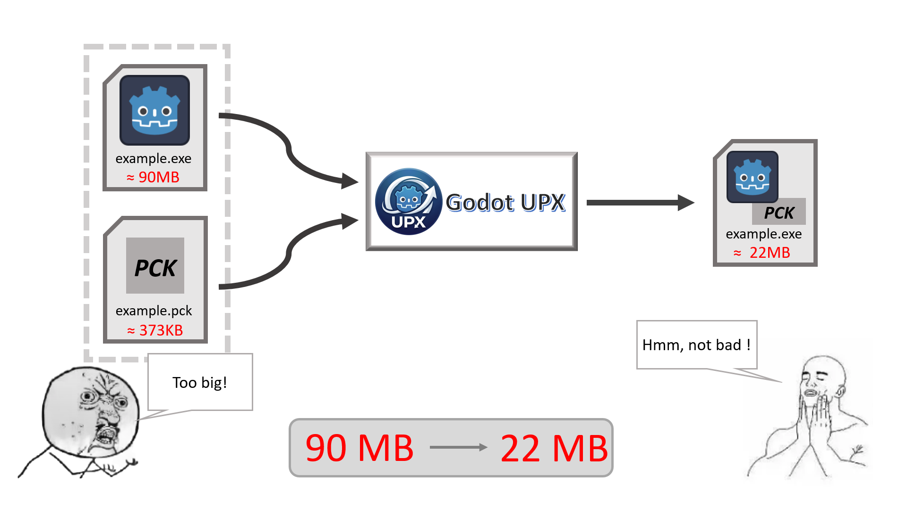
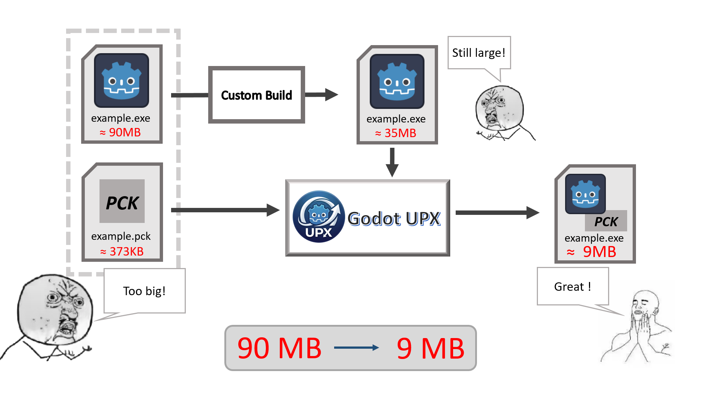

A blank EXE exported by Godot is 90MB! You might have tried compressing your software with UPX, but EXEs with embedded PCK can't be compressed. Is it impossible to have an elegant, small-sized single-file EXE? Now, you can compress software exported by Godot 4.5 and above using this tool, with a minimum compression down to 22MB, and the PCK is embedded!

If you perform a custom build, the size of the exe file can be even smaller (for example, this compression software itself has been compressed and custom-built, reaching 9MB!).

This software provides a simple and sufficient GUI.
 
Principle: After compressing the non-embedded EXE with UPX, directly add the binary data of the PCK at the end of the EXE, and finally append 0 or 4 bytes of zeros, 4 bytes of PCK length information, 4 bytes of zeros, and 4 bytes of PCK flag.

Of course, you don't need to know all that. Just download it and use it directly!
(The release version includes upx.exe, so you don't need to download it separately. Of course, you can also replace it with other versions of upx.)

support English(en) and 中文简体(zh-CN)
